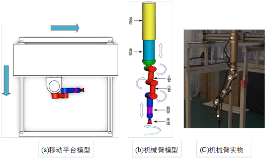

# 简介
## 数据集
使用自建数据集 RoboArm，此为机械臂示意图



关键点标注如下：

```
   0: 'base',       # 基座
   1: 'shoulder',   # 肩部
   2: 'big arm',    # 大臂
   3: 'small arm',  # 小臂
   4: 'wrist',      # 腕部
   5: 'end',        # 末端
```


# 快速开始
## 安装
1. 克隆这个 repo，我们将把你克隆 Robotic Arm Estimation 的目录称为 {POSE_ROOT}
2. 安装依赖项。
3. 下载 pytorch imagenet 预训练模型. 请在 {POSE_ROOT} 模型下下载它们，并使它们看起来像这样：

   ```
   ${POSE_ROOT}/models
   └── pytorch
       └── imagenet
           ├── resnet152-b121ed2d.pth
           ├── resnet50-19c8e357.pth
           └── mobilenet_v2.pth.tar
   ```
   它们可以从以下链接下载：
   https://onedrive.live.com/?authkey=%21AF9rKCBVlJ3Qzo8&id=93774C670BD4F835%21930&cid=93774C670BD4F835


4. 初始化输出（训练模型输出目录）和日志（张量板日志目录）目录。
   ```
   mkdir output 
   mkdir log
   ```

   你的目录树应该是这样的

   ```
   ${POSE_ROOT}
   ├── data
   ├── experiments-local
   ├── experiments-philly
   ├── lib
   ├── log
   ├── models
   ├── output
   ├── pose_estimation
   ├── README.md
   ├── requirements.txt
   ```

## 数据准备
**对于 RoboArm 数据**，让它们看起来像这样:

```
${POSE_ROOT}
|-- data
|-- |-- RoboArm
    |-- |-- annot
        |   |-- test.json
        |   |-- train.json
        |   |-- valid.json
        |-- images
            |-- 0-000001.jpg
            |-- 0-000004.jpg
            |-- 1-000001.jpg
```

如果您将图像文件压缩成单个 zip 文件，您应该像这样组织数据：

```
${POSE_ROOT}
|-- data
`-- |-- RoboArm
    `-- |-- annot
        |   |-- test.json
        |   |-- train.json
        |   `-- valid.json
        `-- images.zip
            `-- images
                  |-- 0-000001.jpg
                  |-- 0-000004.jpg
                  |-- 1-000001.jpg
```


**用于 3D 姿势估计的肢体长度**, 请从以下位置下载肢体长度先验数据
https://1drv.ms/u/s!AjX41AtnTHeTiQs7hDJ2sYoGJDEB?e=YyJcI4

把它放进去 data/pict/pairwise.pkl


## 2D 训练和测试
**RoboArm 数据集上的关键点识别训练和验证**
```
python run/pose2d/train.py --cfg ../../experiments-local/RoboArm/resnet50/256_fusion.yaml
python run/pose2d/valid.py --cfg ../../experiments-local/RoboArm/resnet50/256_fusion.yaml
```
## 3D 测试
**RoboArm 上的多视图测试（基于 CPU 或 GPU）**
```
python run/pose3d/estimate.py --cfg ../../experiments-local/RoboArm/resnet50/256_fusion.yaml (CPU 版本)
python run/pose3d/estimate_cuda.py --cfg ../../experiments-local/RoboArm/resnet50/256_fusion.yaml (GPU 版本)
```


